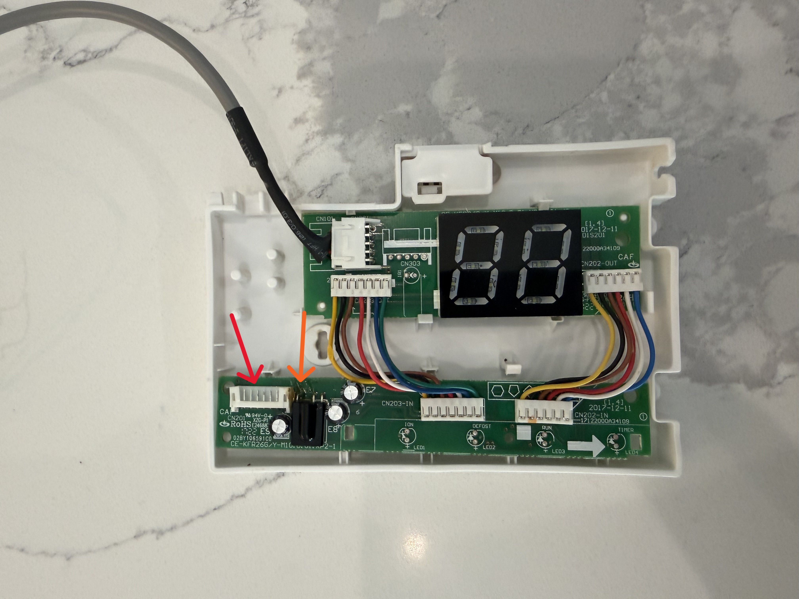
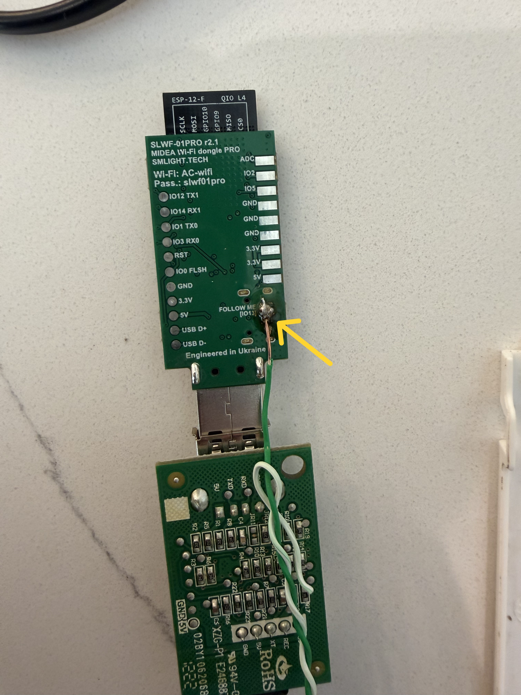

# SLWF-01Pro Follow Me Function Guide

A complete guide to implementing the **Follow Me** function on Midea-based mini splits (including Senville) using the SLWF-01Pro Wi-Fi module and Home Assistant.

## Overview

Mini-split AC units typically have temperature sensors located on the intake, which often results in inaccurate room temperature readings - especially for wall or ceiling-mounted units. The **Follow Me** function allows you to use an external temperature sensor from Home Assistant to provide accurate room temperature data to your AC unit.

This guide covers the Senville Leto series but should work for other Midea-based units with similar hardware.

## What You'll Need

| Item | Notes |
|------|-------|
| SLWF-01Pro | Wi-Fi module from SMLIGHT |
| Soldering iron | Basic skills required (Here is the kit i puchased: [Example on Amazon](https://www.amazon.com/dp/B087767KNW)) |
| Thin wire | Cat6 cable works well (single solid conductor) |
| External temperature sensor | Configured in Home Assistant (e.g., Zooz ZSE11 Q Sensor) |

## Hardware Installation

### Step 1: Connect the SLWF-01Pro Module

The Senville Leto series uses a **proprietary USB port** that may seem incompatible at first.

**To connect:**
1. Use a flathead screwdriver to carefully pry open the sides of the USB port
2. Gently wiggle the SLWF-01Pro into the port
3. Look for the **blue light** on the SLWF-01Pro to blink - this confirms connectionhttps://github.com/hoboj25/SLWF-01Pro_FollowMe/blob/main/README.md#L56C27
4. The module won't feel 100% seated, but if the blue light blinks and it doesn't fall out easily, you're good

> **Warning:** Do not force the connection. If you see the blue light, it's working.

### Step 2: Solder the Follow Me Connection

To enable the Follow Me function, you need to connect the **IO13 pin** on the SLWF-01Pro to the **Rec 1 OUT pin** on the display board.

> **Note:** On some units, the USB port board is separate from the display board. This guide covers that configuration.

#### 2a. Remove the USB WiFi Port Board
Unscrew the USB WiFi port board from the unit. You can leave the SLWF-01Pro plugged in.

#### 2b. Remove the Display Board
1. Disconnect the display port wire harness (see red arrow in image below)
2. Unscrew the display board from the unit

#### 2c. Identify the Rec 1 OUT Pin
Locate the IR receiver on the display board. The **OUT pin** is typically the leftmost pin (by itself), but verify this on your specific board before soldering.


*Red arrow: Wire harness connector | Orange arrow: Rec 1 OUT pin*

#### 2d. Solder Wire to SLWF-01Pro
Solder a wire to the **FOLLOW ME [IO13]** pin on the back of the SLWF-01Pro board.


*Yellow arrow: IO13 Follow Me pin with soldered wire*

**Wire Tip:** Use a single solid conductor from Cat6 cable:
1. Cut ~8 inches of Cat6 cable (measure distance between connection points)
2. Extract the green pair
3. Strip about 2" of insulation from each end
4. Use the solid copper wire for a clean connection

#### 2e. Complete the Connection
Solder the other end of the wire to the **Rec 1 OUT pin** on the display board.

#### 2f. Reassemble and Test
1. Reconnect the wire harness
2. Reinstall the display board and USB port board
3. Power on the unit

**Quick Test:** Try using your IR remote. If the unit responds to remote commands, the connection is working correctly.

## Home Assistant Configuration

### Understanding the Setup

The SLWF-01Pro does **not** appear in ESPHome Builder, which can be confusing. Instead of editing YAML files directly, you'll create a **Home Assistant automation** to send temperature data to the Follow Me service.

You can verify the Follow Me service exists by checking the storage file:
```
/homeassistant/.storage/esphome.01KXXXXXXXXXXXXXXXXXXXXXXX
```

Look for the `follow_me` service in the JSON:
```json
"services": [
  {
    "name": "follow_me",
    "key": 1664936315,
    "args": [
      {
        "name": "temperature",
        "type": 2
      }
    ],
    "supports_response": 0
  }
]
```

### Create the Automation

1. Go to **Settings > Automations & Scenes > Create Automation**
2. Switch to YAML mode and paste the following:

```yaml
alias: AC Follow Me
description: "Sends external temperature sensor data to AC unit"
triggers:
  - entity_id: sensor.q_sensor_air_temperature
    trigger: state
actions:
  - data:
      temperature: >-
        {{ ((states('sensor.q_sensor_air_temperature') | float - 32) * 5/9) |
        round(1) }}
    action: esphome.air_conditioner_XXXXXX_follow_me
mode: single
```

### Customize the Automation

| Setting | What to Change |
|---------|----------------|
| `entity_id` in triggers | Your temperature sensor entity ID |
| `states('sensor...')` in temperature | Same sensor entity ID |
| `esphome.air_conditioner_XXXXXX_follow_me` | Your ESPHome device's follow_me service |

### Temperature Conversion

The automation above converts **Fahrenheit to Celsius** before sending to the AC unit:
```
((°F - 32) * 5/9)
```

If your sensor reports in Celsius, simplify to:
```yaml
temperature: "{{ states('sensor.your_sensor') | float | round(1) }}"
```

### Sensor Configuration Tips

For optimal performance, configure your temperature sensor with:
- **Reporting period:** 30 seconds
- **Temperature threshold:** 1 degree (reports when temp changes by 1°)

## Troubleshooting

| Issue | Solution |
|-------|----------|
| SLWF-01Pro won't connect | Pry USB port sides carefully, look for blue light |
| Remote doesn't work after mod | Check solder connections, ensure no shorts |
| Follow Me service not found | Verify SLWF-01Pro is connected in Home Assistant |
| Temperature not updating | Check automation is enabled, verify sensor entity IDs |
| Wrong temperature readings | Verify Fahrenheit/Celsius conversion in automation |

## Credits

- Original Follow Me documentation: [andy2002a/MideaESPHome_Follow_Me](https://github.com/andy2002a/MideaESPHome_Follow_Me)
- Senville USB port tip: [Reddit post](https://www.reddit.com/r/homeassistant/comments/1fsj56d/senville_pulled_a_dirty_one_with_this_proprietary/)
- SLWF-01Pro hardware: [SMLIGHT](https://smlight.tech/)

## Contributing

Found an issue or have improvements? Feel free to open an issue or submit a pull request.

## License

MIT License - Feel free to use and modify this guide.


